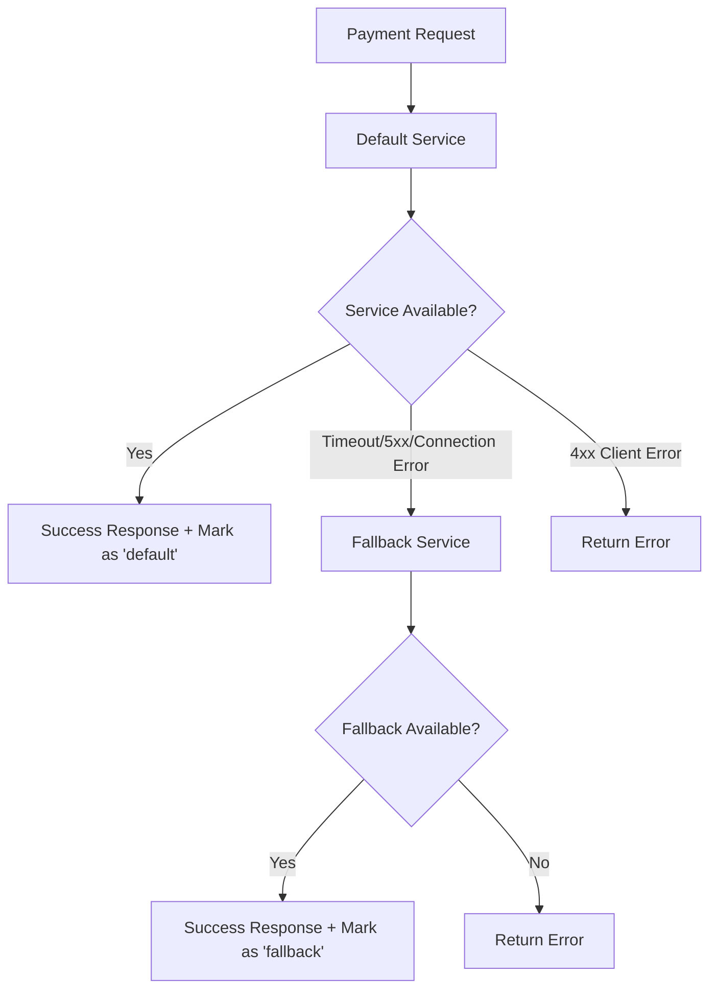

# Payment Processor API

A Rails 8 application that provides a secure, idempotent payment processing API with precise money handling, robust validation, and external payment service integration with automatic fallback capabilities and service usage tracking.

## Table of Contents

- [API Overview](#api-overview)
- [Architecture Decisions](#architecture-decisions)
- [Payment Service Integration](#payment-service-integration)
- [File Structure](#file-structure)
- [Environment Configuration](#environment-configuration)
- [API Endpoints](#api-endpoints)
- [Data Models](#data-models)
- [Usage Examples](#usage-examples)
- [Testing](#testing)
- [Development](#development)

## API Overview

The Payment Processor API provides both JSON and HTML interfaces for creating, reading, updating, and deleting payment records. It features:

- **Idempotent operations** using correlation IDs
- **Precise money handling** using integer cents
- **External payment service integration** with automatic fallback
- **Payment service tracking** to monitor which service handled each payment
- **Comprehensive validation**
- **Dual format support** (JSON API + HTML forms)

## Architecture Decisions

### 1. Money Storage Strategy

**Decision**: Store monetary amounts as integers in cents rather than decimals.

**Reasoning**:
- **Precision**: Avoids floating-point arithmetic errors common in financial calculations
- **Performance**: Integer operations are faster than decimal operations
- **Consistency**: Eliminates rounding inconsistencies across different operations
- **Industry Standard**: Follows best practices used by payment processors like Stripe

### 2. Correlation ID as Idempotency Key

**Decision**: Use UUID-based `correlationId` for idempotency control.

**Reasoning**:
- **Idempotency**: Prevents duplicate payments from network issues or client retries
- **Traceability**: Enables request tracking across distributed systems
- **Uniqueness**: UUID format ensures global uniqueness
- **External Integration**: Common pattern in payment APIs (Stripe, PayPal, etc.)

### 3. Dual API Support

**Decision**: Support both JSON API and HTML forms from the same controller.

**Reasoning**:
- **Flexibility**: Accommodates different client types (web apps, mobile apps, webhooks)
- **Maintainability**: Single codebase for both interfaces
- **Rails Convention**: Leverages Rails' built-in format handling
- **Testing**: Easier to test both interfaces with shared logic

### 4. Payment Service Routing Strategy

**Decision**: Implement default/fallback payment service architecture with automatic routing.

**Reasoning**:
- **Cost Optimization**: Use cheaper default service when available
- **Reliability**: Automatic fallback ensures high availability
- **Smart Error Handling**: Only fallback for service unavailability (5xx errors, timeouts, connection issues)
- **Transparency**: Same API interface regardless of which service is used
- **Monitoring**: Detailed logging for service selection and fallback events

### 5. Payment Service Tracking

**Decision**: Track which payment service (default or fallback) was used for each payment.

**Reasoning**:
- **Cost Analysis**: Monitor usage patterns to optimize service costs
- **Performance Monitoring**: Identify fallback frequency and service reliability
- **Audit Trail**: Maintain records of which external service processed each payment
- **Business Intelligence**: Enable reporting on service usage and effectiveness
- **Troubleshooting**: Facilitate debugging by knowing which service handled specific payments

## Payment Service Integration

The application integrates with external payment services using a sophisticated routing system that automatically handles failover between default and fallback services while tracking which service was used.

### Service Architecture

```
PaymentServiceRouter
├── DefaultPaymentService (Primary - Cheaper)
└── FallbackPaymentService (Backup - More Expensive)
```

### Service Usage Tracking

Every successful payment registration records which service was used:

- **`payment_service: 'default'`**: Payment was processed by the primary service
- **`payment_service: 'fallback'`**: Payment was processed by the backup service
- **`payment_service: null`**: Payment exists but external service registration failed or was not attempted (e.g., for duplicate requests)

### Automatic Fallback Logic

1. **Primary Attempt**: All requests start with the default service
2. **Failure Detection**: Monitors for service unavailability:
   - Network timeouts (`Net::ReadTimeout`, `Net::OpenTimeout`)
   - Connection errors (`SocketError`, `Net::HTTPError`)
   - Server errors (HTTP 5xx status codes)
3. **Automatic Fallback**: Transparently switches to fallback service
4. **Service Tracking**: Records which service successfully processed the payment
5. **Error Propagation**: Client errors (4xx) are immediately returned without fallback

### Service Selection Flow



## Environment Configuration

Configure the payment services using environment variables:

### Required Environment Variables

```bash
# Default (Primary) Payment Service
DEFAULT_PAYMENT_SERVICE_URL=http://localhost:8001

# Fallback (Backup) Payment Service
FALLBACK_PAYMENT_SERVICE_URL=http://localhost:8002
```

### Default Values

If environment variables are not set, the system uses these defaults:

- **Default Service**: `http://localhost:8001`
- **Fallback Service**: `http://localhost:8002`

### Configuration Examples

```bash
# Development
export DEFAULT_PAYMENT_SERVICE_URL=https://sandbox-default.paymentprovider.com
export FALLBACK_PAYMENT_SERVICE_URL=https://sandbox-fallback.paymentprovider.com

# Production
export DEFAULT_PAYMENT_SERVICE_URL=http://localhost:8001
export FALLBACK_PAYMENT_SERVICE_URL=http://localhost:8002

# Testing
export DEFAULT_PAYMENT_SERVICE_URL=https://test-default.paymentprovider.com
export FALLBACK_PAYMENT_SERVICE_URL=https://test-fallback.paymentprovider.com
```

## API Endpoints

### Create Payment

Creates a new payment or returns existing payment if correlationId already exists. Automatically registers with external payment service.

```bash
POST /payments.json
Content-Type: application/json

{
  "correlationId": "550e8400-e29b-41d4-a716-446655440000",
  "amount": 19.90
}
```

**Response** (201 Created):
```json
{
  "id": 1,
  "created_at": "2025-07-11T00:00:00.000Z",
  "updated_at": "2025-07-11T00:00:00.000Z",
  "correlationId": "550e8400-e29b-41d4-a716-446655440000",
  "amount": 19.90,
  "payment_service": "default",
  "url": "http://localhost:3000/payments/1.json"
}
```

**Idempotent Response** (200 OK for existing payment):
```json
{
  "id": 1,
  "created_at": "2025-07-11T00:00:00.000Z",
  "updated_at": "2025-07-11T00:00:00.000Z",
  "correlationId": "550e8400-e29b-41d4-a716-446655440000",
  "amount": 19.90,
  "payment_service": "default",
  "url": "http://localhost:3000/payments/1.json"
}
```

## Data Models

### Payment

| Field | Type | Description | Validation |
|-------|------|-------------|------------|
| `id` | Integer | Primary key | Auto-generated |
| `amount_in_cents` | Integer | Amount in cents | Required, > 0 |
| `correlation_id` | String | UUID for idempotency | Required, unique, UUID format |
| `payment_service` | String | Service used ('default', 'fallback', or null) | Optional, must be 'default' or 'fallback' if present |
| `created_at` | DateTime | Creation timestamp | Auto-generated |
| `updated_at` | DateTime | Last update timestamp | Auto-generated |

### Virtual Attributes

| Method | Description | Example |
|--------|-------------|---------|
| `amount` | Returns amount in dollars | `19.90` |
| `amount=(dollars)` | Sets amount from dollars | `payment.amount = 19.90` |
| `formatted_amount` | Returns formatted currency | `"$19.90"` |

### Payment Service Field Values

- **`'default'`**: Payment was successfully registered with the primary payment service
- **`'fallback'`**: Payment was successfully registered with the backup payment service
- **`null`**: Payment was created but external service registration was not completed (idempotent requests or service failures)

## Testing

The application includes comprehensive test coverage with WebMock for external service simulation:

```bash
# Run all tests
rails test

# Run specific test files
rails test test/models/payment_test.rb
rails test test/services/payment_creation_service_test.rb
```

### Test Coverage

- **Model Validation**: Payment field validation including payment_service constraints
- **Service Integration**: External payment service registration with both default and fallback services
- **Fallback Logic**: Automatic service switching during outages
- **Service Tracking**: Verification that the correct service is recorded for each payment
- **Idempotency**: Ensuring duplicate requests don't trigger additional service calls
- **Error Handling**: Payment creation success even when external services fail

## Development

### Setup

```bash
# Install dependencies
bundle install

# Setup database
rails db:create db:migrate

# Set environment variables
export DEFAULT_PAYMENT_SERVICE_URL=http://localhost:8001
export FALLBACK_PAYMENT_SERVICE_URL=http://localhost:8002

# Run the application
rails server
```
