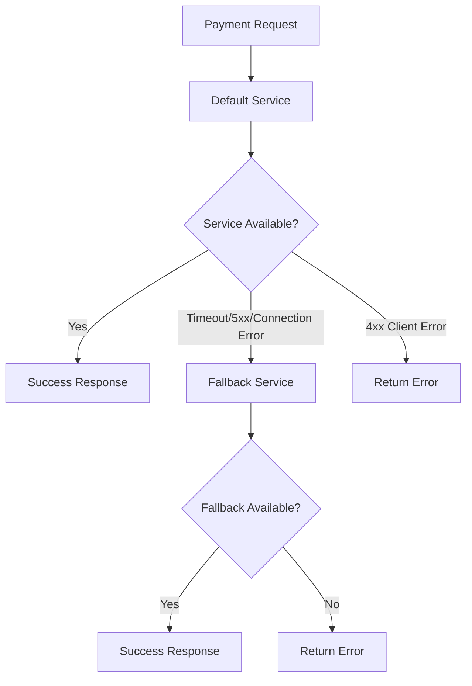

# Payment Processor API

A Rails 8 application that provides a secure, idempotent payment processing API with precise money handling, robust validation, and external payment service integration with automatic fallback capabilities.

## Table of Contents

- [API Overview](#api-overview)
- [Architecture Decisions](#architecture-decisions)
- [Payment Service Integration](#payment-service-integration)
- [File Structure](#file-structure)
- [Environment Configuration](#environment-configuration)
- [API Endpoints](#api-endpoints)
- [Data Models](#data-models)
- [Usage Examples](#usage-examples)
- [Testing](#testing)
- [Development](#development)

## API Overview

The Payment Processor API provides both JSON and HTML interfaces for creating, reading, updating, and deleting payment records. It features:

- **Idempotent operations** using correlation IDs
- **Precise money handling** using integer cents
- **UUID-based correlation tracking**
- **External payment service integration** with automatic fallback
- **Comprehensive validation**
- **Dual format support** (JSON API + HTML forms)

## Architecture Decisions

### 1. Money Storage Strategy

**Decision**: Store monetary amounts as integers in cents rather than decimals.

**Reasoning**:
- **Precision**: Avoids floating-point arithmetic errors common in financial calculations
- **Performance**: Integer operations are faster than decimal operations
- **Consistency**: Eliminates rounding inconsistencies across different operations
- **Industry Standard**: Follows best practices used by payment processors like Stripe

**Implementation**:
```ruby
# Database: amount_in_cents (integer)
# API: amount (float in dollars)
# Internal conversion handles precision
```

### 2. Correlation ID as Idempotency Key

**Decision**: Use UUID-based `correlationId` for idempotency control.

**Reasoning**:
- **Idempotency**: Prevents duplicate payments from network issues or client retries
- **Traceability**: Enables request tracking across distributed systems
- **Uniqueness**: UUID format ensures global uniqueness
- **External Integration**: Common pattern in payment APIs (Stripe, PayPal, etc.)

**Implementation**:
```ruby
# External API field: "correlationId"
# Internal database field: "correlation_id"
# Validation: UUID format + uniqueness constraint
```

### 3. Dual API Support

**Decision**: Support both JSON API and HTML forms from the same controller.

**Reasoning**:
- **Flexibility**: Accommodates different client types (web apps, mobile apps, webhooks)
- **Maintainability**: Single codebase for both interfaces
- **Rails Convention**: Leverages Rails' built-in format handling
- **Testing**: Easier to test both interfaces with shared logic

**Implementation**:
```ruby
# Content-Type detection for parameter extraction
# Format-specific responses (JSON vs HTML)
# Shared validation and business logic
```

### 4. Field Name Mapping

**Decision**: Map external `correlationId` to internal `correlation_id`.

**Reasoning**:
- **External Consistency**: camelCase follows JSON API conventions
- **Internal Consistency**: snake_case follows Rails conventions
- **Database Design**: Rails conventions for column naming
- **API Clarity**: Clear separation between external and internal representations

### 5. CSRF Protection Strategy

**Decision**: Skip CSRF protection for JSON API requests only.

**Reasoning**:
- **API Compatibility**: External clients don't have access to CSRF tokens
- **Security**: HTML forms maintain CSRF protection
- **Selective Bypass**: Only JSON requests bypass protection
- **Rails Security**: Maintains Rails' security model for web interface

### 6. Idempotency Behavior

**Decision**: Return existing payment (201 Created) instead of validation error (422) for duplicate correlation IDs.

**Reasoning**:
- **Client Simplicity**: Clients don't need special handling for retries
- **Network Resilience**: Handles network timeouts and duplicate requests gracefully
- **Consistent Response**: Same response structure for original and duplicate requests
- **Industry Standard**: Follows HTTP idempotency best practices

### 7. Payment Service Routing Strategy

**Decision**: Implement default/fallback payment service architecture with automatic routing.

**Reasoning**:
- **Cost Optimization**: Use cheaper default service when available
- **Reliability**: Automatic fallback ensures high availability
- **Smart Error Handling**: Only fallback for service unavailability (5xx errors, timeouts, connection issues)
- **Transparency**: Same API interface regardless of which service is used
- **Monitoring**: Detailed logging for service selection and fallback events

**Implementation**:
```ruby
# PaymentServiceRouter automatically chooses between:
# - DefaultPaymentService (cheaper, primary)
# - FallbackPaymentService (more expensive, backup)
# Fallback triggers: timeouts, connection errors, 5xx server errors
# No fallback: 4xx client errors (re-raised immediately)
```

## Payment Service Integration

The application integrates with external payment services using a sophisticated routing system that automatically handles failover between default and fallback services.

### Service Architecture

```
PaymentServiceRouter
├── DefaultPaymentService (Primary - Cheaper)
└── FallbackPaymentService (Backup - More Expensive)
```

### Automatic Fallback Logic

1. **Primary Attempt**: All requests start with the default service
2. **Failure Detection**: Monitors for service unavailability:
   - Network timeouts (`Net::ReadTimeout`, `Net::OpenTimeout`)
   - Connection errors (`SocketError`, `Net::HTTPError`)
   - Server errors (HTTP 5xx status codes)
3. **Automatic Fallback**: Transparently switches to fallback service
4. **Error Propagation**: Client errors (4xx) are immediately returned without fallback

### Service Selection Flow



### Integration Features

- **Automatic ISO 8601 timestamp generation** for `requestedAt` field
- **Comprehensive error handling** with custom `PaymentServiceError` class
- **Detailed logging** for debugging and monitoring service usage
- **Timeout configuration** for network requests
- **JSON payload formatting** with correlation ID and amount

## File Structure

The payment service integration is organized into focused, maintainable modules:

```
app/services/
├── payment_service_client.rb              # Backward compatibility wrapper
├── payment_creation_service.rb            # Main payment creation logic
└── payment_services/
    ├── payment_service_error.rb           # Custom error class
    ├── base_payment_service.rb            # Shared HTTP functionality
    ├── default_payment_service.rb         # Primary payment service
    ├── fallback_payment_service.rb        # Backup payment service
    └── payment_service_router.rb          # Smart routing logic
```

### File Responsibilities

| File | Purpose | Key Features |
|------|---------|--------------|
| `payment_service_error.rb` | Error handling | Status codes, response body tracking |
| `base_payment_service.rb` | HTTP communication | Request building, response parsing, logging |
| `default_payment_service.rb` | Primary service | Default payment service configuration |
| `fallback_payment_service.rb` | Backup service | Fallback payment service configuration |
| `payment_service_router.rb` | Smart routing | Automatic failover, error detection |
| `payment_service_client.rb` | Compatibility | Backward compatibility for existing code |

## Environment Configuration

Configure the payment services using environment variables:

### Required Environment Variables

```bash
# Default (Primary) Payment Service
DEFAULT_PAYMENT_SERVICE_URL=https://api.defaultpayment.com

# Fallback (Backup) Payment Service
FALLBACK_PAYMENT_SERVICE_URL=https://api.fallbackpayment.com
```

### Default Values

If environment variables are not set, the system uses these defaults:

- **Default Service**: `https://api.defaultpayment.com`
- **Fallback Service**: `https://api.fallbackpayment.com`

### Configuration Examples

```bash
# Development
export DEFAULT_PAYMENT_SERVICE_URL=https://sandbox-default.paymentprovider.com
export FALLBACK_PAYMENT_SERVICE_URL=https://sandbox-fallback.paymentprovider.com

# Production
export DEFAULT_PAYMENT_SERVICE_URL=https://api.defaultpayment.com
export FALLBACK_PAYMENT_SERVICE_URL=https://api.fallbackpayment.com

# Testing
export DEFAULT_PAYMENT_SERVICE_URL=https://test-default.paymentprovider.com
export FALLBACK_PAYMENT_SERVICE_URL=https://test-fallback.paymentprovider.com
```

## API Endpoints

### Create Payment

Creates a new payment or returns existing payment if correlationId already exists. Automatically registers with external payment service.

```bash
POST /payments.json
Content-Type: application/json

{
  "correlationId": "550e8400-e29b-41d4-a716-446655440000",
  "amount": 19.90
}
```

**Response** (201 Created):
```json
{
  "id": 1,
  "created_at": "2025-07-11T00:00:00.000Z",
  "updated_at": "2025-07-11T00:00:00.000Z",
  "correlationId": "550e8400-e29b-41d4-a716-446655440000",
  "amount": 19.90,
  "url": "http://localhost:3000/payments/1.json"
}
```

**Note**: Payment is created locally first, then registered with external service. If external service fails, payment creation still succeeds (logged for retry).

### Get Payment

```bash
GET /payments/1.json
```

### List Payments

```bash
GET /payments.json
```

### Update Payment

```bash
PUT /payments/1.json
Content-Type: application/json

{
  "correlationId": "550e8400-e29b-41d4-a716-446655440001",
  "amount": 25.50
}
```

### Delete Payment

```bash
DELETE /payments/1.json
```

## Data Models

### Payment

| Field | Type | Description | Validation |
|-------|------|-------------|------------|
| `id` | Integer | Primary key | Auto-generated |
| `amount_in_cents` | Integer | Amount in cents | Required, > 0 |
| `correlation_id` | String | UUID for idempotency | Required, unique, UUID format |
| `created_at` | DateTime | Creation timestamp | Auto-generated |
| `updated_at` | DateTime | Last update timestamp | Auto-generated |

### Virtual Attributes

| Method | Description | Example |
|--------|-------------|---------|
| `amount` | Returns amount in dollars | `19.90` |
| `amount=(dollars)` | Sets amount from dollars | `payment.amount = 19.90` |
| `formatted_amount` | Returns formatted currency | `"$19.90"` |

## Usage Examples

### Successful Payment Creation

```bash
curl -X POST http://localhost:3000/payments.json \
  -H "Content-Type: application/json" \
  -H "Accept: application/json" \
  -d '{
    "correlationId": "550e8400-e29b-41d4-a716-446655440000",
    "amount": 19.90
  }'
```

### Idempotent Request (Same correlationId)

```bash
# Second request with same correlationId returns same payment
# External service is NOT called again (idempotency)
curl -X POST http://localhost:3000/payments.json \
  -H "Content-Type: application/json" \
  -H "Accept: application/json" \
  -d '{
    "correlationId": "550e8400-e29b-41d4-a716-446655440000",
    "amount": 19.90
  }'
```

**Both requests return identical response with same `id` and `created_at`**

### Validation Error Example

```bash
curl -X POST http://localhost:3000/payments.json \
  -H "Content-Type: application/json" \
  -H "Accept: application/json" \
  -d '{
    "correlationId": "invalid-uuid",
    "amount": 19.90
  }'
```

**Response** (422 Unprocessable Entity):
```json
{
  "correlation_id": ["must be a valid UUID"]
}
```

### External Service Integration Example

When a payment is created, the system automatically:

1. **Creates local payment record**
2. **Registers with default payment service**:
   ```json
   POST https://api.defaultpayment.com/payments
   {
     "correlationId": "550e8400-e29b-41d4-a716-446655440000",
     "amount": 19.90,
     "requestedAt": "2025-07-11T00:00:00.000Z"
   }
   ```
3. **Falls back if needed**:
   ```json
   POST https://api.fallbackpayment.com/payments
   {
     "correlationId": "550e8400-e29b-41d4-a716-446655440000",
     "amount": 19.90,
     "requestedAt": "2025-07-11T00:00:00.000Z"
   }
   ```

## Testing

The application includes comprehensive test coverage with WebMock for external service simulation:

```bash
# Run all tests
rails test

# Run specific test files
rails test test/models/payment_test.rb
rails test test/controllers/payments_controller_test.rb
rails test test/services/payment_service_client_test.rb
rails test test/services/payment_creation_service_test.rb
```

**Test Coverage:**
- **70 tests with 217 assertions**
- Model validations and methods
- Controller actions (JSON and HTML)
- Idempotency behavior
- Payment service integration
- Automatic fallback scenarios
- Error handling and edge cases
- WebMock stubs for external services

### Payment Service Tests

The payment service integration includes dedicated test suites:

- **`PaymentServiceClientTest`**: Backward compatibility tests
- **`PaymentServiceRouterTest`**: Smart routing and fallback logic
- **`DefaultPaymentServiceTest`**: Primary service configuration
- **`FallbackPaymentServiceTest`**: Backup service configuration

Test scenarios include:
- ✅ Successful payment registration with default service
- ✅ Automatic fallback on server errors (5xx)
- ✅ Automatic fallback on network timeouts
- ✅ Automatic fallback on connection errors
- ✅ No fallback for client errors (4xx)
- ✅ Error handling when both services fail
- ✅ Environment variable configuration
- ✅ Service-specific URL handling

## Development

### Setup

```bash
# Install dependencies
bundle install

# Setup database
rails db:create db:migrate

# Set environment variables
export DEFAULT_PAYMENT_SERVICE_URL=https://sandbox-default.paymentprovider.com
export FALLBACK_PAYMENT_SERVICE_URL=https://sandbox-fallback.paymentprovider.com

# Run the application
rails server
```

### Monitoring Payment Services

The application provides detailed logging for payment service operations:

```ruby
# Service selection
Rails.logger.info "Attempting payment registration with default service"

# Fallback events
Rails.logger.warn "Default payment service unavailable, falling back to fallback service"

# Request/response logging
Rails.logger.info "Making POST request to https://api.defaultpayment.com/payments (DefaultPaymentService)"
Rails.logger.info "Payment service response: 200 OK (DefaultPaymentService)"

# Error logging
Rails.logger.error "Payment service timeout (DefaultPaymentService): execution expired"
```

### Adding New Payment Services

To add a new payment service:

1. **Create service class** inheriting from `BasePaymentService`
2. **Configure environment variable** for the service URL
3. **Update router** to include the new service in failover chain
4. **Add tests** for the new service integration

Example:
```ruby
# app/services/payment_services/premium_payment_service.rb
class PremiumPaymentService < BasePaymentService
  def initialize(timeout: 30)
    base_url = ENV["PREMIUM_PAYMENT_SERVICE_URL"] || "https://api.premiumpayment.com"
    super(base_url: base_url, timeout: timeout)
  end
end
```
